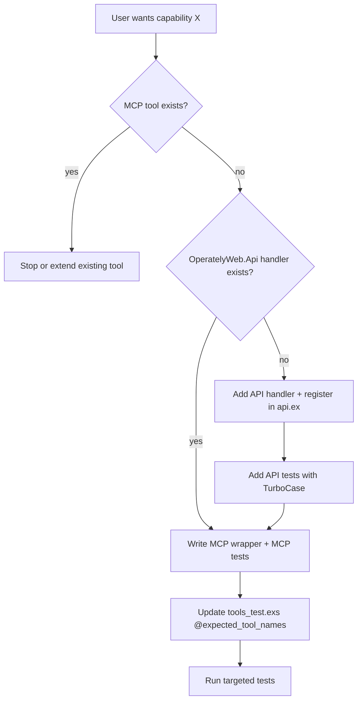

# MCP Tools

MCP tools are thin wrappers over `OperatelyWeb.Api.*` handlers. API endpoints
are always the source of truth for auth, permissions, business logic, and
serialization. MCP tools only declare MCP-facing metadata (schemas, scopes,
examples) and adapt string-key JSON arguments into API inputs.

For templates, test skeletons, sort_order bands, and a full walkthrough, see
[reference.md](reference.md).

## Architecture



| Layer | Location | Responsibility |
| ----- | -------- | -------------- |
| API (source of truth) | `app/lib/operately_web/api/` | Auth, permissions, business logic, serialization |
| API wrappers (when needed) | `app/lib/operately_web/api/wrappers/` | Adapt inputs MCP exposes differently (e.g. hub scope → `resource_hub_id`) |
| MCP tool | `app/lib/operately_web/mcp/tools/` | JSON schema, MCP metadata, string-key arg decoding, call API |
| Catalog | `Registry` (auto) + `tools_test.exs` (manual) | Discovery and invariant tests |

Product rationale: `specs/0012-operately-mcp.md` § "Shared execution across surfaces".

## OAuth scopes

MCP grants use two scopes. There is no `mcp:destructive` scope — destructive tools stay on
`mcp:write`, matching the CLI write-token model.

| Scope | `safety_classification` | Tool access |
| ----- | ----------------------- | ----------- |
| `mcp:read` | `:read_only` | Read-only tools |
| `mcp:write` | `:write` or `:destructive` | All write and destructive tools |

### Default scope on connect

`Operately.Mcp.Resources.parse_scopes/1` defaults **nil, empty string, or empty list** to
`mcp:read` only. Clients that need write or destructive access must request `mcp:write`
explicitly in the OAuth `scope` parameter.

When authoring tools:

- Read-only → `required_scopes: ["mcp:read"]`, `safety_classification: :read_only`,
  `read_annotations()` (`readOnlyHint: true`)
- Write → `required_scopes: ["mcp:write"]`, `safety_classification: :write`,
  `write_annotations()`
- Destructive → `required_scopes: ["mcp:write"]`, `safety_classification: :destructive`,
  `write_annotations()` plus `destructiveHint: true` in descriptors (client UX only —
  not a third scope)

Runtime enforcement in `OperatelyWeb.McpController` checks token scopes against each tool's
`required_scopes` before dispatch.

## Scope

This skill covers adding, changing, and reviewing MCP tool wrappers.

Removing a tool requires deleting the module, its test, and its entry in
`@expected_tool_names`.

## Workflow

Always follow these three steps before writing code.

### 1. Check if the MCP tool already exists

- Grep `app/lib/operately_web/mcp/tools/` by domain and action name
- Read `@expected_tool_names` in `app/test/operately/mcp/tools_test.exs` — the
  canonical sorted catalog
- Run the catalog test or inspect `OperatelyWeb.Mcp.Tools.list_definitions/0`
- Do **not** add a duplicate tool with a slightly different name

If a tool already covers the capability, stop or extend it instead of creating
a new one.

### 2. Check if an API endpoint already exists

- Search `app/lib/operately_web/api.ex` for `query(:…)` / `mutation(:…)`
  registrations
- Search `app/lib/operately_web/api/{domain}/` for matching modules
- Check `app/lib/operately_web/api/wrappers/` for API module wrappers, which behave like 
usual endpoints
- Read sibling MCP tools in the same domain — they show the expected API alias
  and input mapping

If the API exists and accepts the inputs MCP needs, skip to step 3 (wrapper
only).

### 3. Create endpoint first, then MCP wrapper

When no suitable API exists, **always API before MCP**:

1. Add API module under `app/lib/operately_web/api/{domain}/{action}.ex`
   - Queries: `use TurboConnect.Query`
   - Mutations: `use TurboConnect.Mutation` + `Action` pipeline
2. Register in `app/lib/operately_web/api.ex` as `query(:…)` or `mutation(:…)`
3. Add API tests under `app/test/operately_web/api/{domain}/{action}_test.exs`
   using `OperatelyWeb.TurboCase` — cover auth, validation, permissions
4. Add MCP wrapper under `app/lib/operately_web/mcp/tools/{domain}/{action}.ex`
5. Add MCP unit test under
   `app/test/operately_web/mcp/tools/{domain}/{action}_test.exs`
6. Update catalog test: add tool name to `@expected_tool_names` at the correct
   position (`sort_order`, then alphabetical tie-break)

**Canonical example:** `list_task_statuses` — API was added first
(`app/lib/operately_web/api/tasks/list_task_statuses.ex` +
`app/test/operately_web/api/tasks/list_task_statuses_test.exs`), then the MCP
wrapper (`app/lib/operately_web/mcp/tools/tasks/list_task_statuses.ex` +
`app/test/operately_web/mcp/tools/tasks/list_task_statuses_test.exs`).

## MCP Tool Implementation

### Module contract

- `use OperatelyWeb.Mcp.Tool`
- Module: `OperatelyWeb.Mcp.Tools.{Domain}.{PascalCase}`
- File: `app/lib/operately_web/mcp/tools/{domain}/{snake_case}.ex`
- Public tool `name`: `snake_case` verb phrase (stable MCP API)
- Implement `definition/0` and `call/2`
- No manual registry edit — `OperatelyWeb.Mcp.Catalog.Registry` auto-discovers
  compiled modules under `OperatelyWeb.Mcp.Tools.*`

### `definition/0` fields

| Field | Guidance |
| ----- | -------- |
| `company_mode` | `:none`, `:authenticated`, or `:resource_derived` — never accept `company_id` in input |
| `required_scopes` + `safety_classification` | Read → `["mcp:read"]` + `:read_only` + `read_annotations()`; Write → `["mcp:write"]` + `:write` + `write_annotations()` |
| `sort_order` | Catalog ordering band — see [reference.md](reference.md) |
| `input_schema` / `output_schema` | `JsonSchema.object/2`; string keys; `required` array only for truly required args |
| `examples` | At least one realistic example with encoded IDs like `"task_123"` |
| `discovery_metadata` | `%{"category" => "tasks"}` etc. |

### `call/2` adaptation

- Arguments arrive as **string-key maps**; API inputs use **atom keys**
- Always decode IDs via `OperatelyWeb.Mcp.Helpers.decode_id/1` /
  `decode_optional_id/1` — never raw UUID parsing
- Return `{:ok, atom_key_map}` matching `output_schema` top-level keys, or
  `{:error, :invalid_arguments | :not_found | :forbidden | …}`
- Use `{:error, :invalid_arguments}` for bad client input (malformed IDs,
  conflicting scopes, invalid enums)
- **Optional field conventions** are domain-specific — check sibling tools:
  - Omit optional field to clear (e.g. `update_project_due_date`: omit
    `due_date` → clear)
  - Use `Helpers.parse_day_date/1`, `markdown_to_rich_text/1`, `put_optional/3`
    as appropriate
- **Enums**: validate against a whitelist before `String.to_existing_atom/1`,
  or use explicit decode clauses (see `close_project`, `create_link`)
- **Hub scope**: exactly one of `space_id`, `project_id`, `goal_id` via
  `Helpers.decode_hub_scope/1`; prefer `Api.Wrappers.DocsAndFiles.*` for
  create/list operations

Do **not** call business logic directly from MCP — always go through API.

## Testing

Two test layers — **both required for new capabilities**:

| Layer | File pattern | Framework | What to test |
| ----- | ------------ | --------- | ------------ |
| API (exhaustive) | `app/test/operately_web/api/{domain}/{action}_test.exs` | `OperatelyWeb.TurboCase` | Auth, validation, permissions, happy paths |
| MCP (adaptation) | `app/test/operately_web/mcp/tools/{domain}/{action}_test.exs` | `Operately.DataCase` + `ToolConnHelper` | Call `ToolModule.call/2` directly; ID decoding; cross-company `not_found`; optional-field behavior |

MCP tests assume API correctness — do not re-test every permission matrix in MCP
tests.

**Catalog test (always update):** add name to `@expected_tool_names` in
`app/test/operately/mcp/tools_test.exs`. Missing entry fails CI.

Run targeted tests:

```bash
make test FILE=app/test/operately_web/api/tasks/list_task_statuses_test.exs
make test FILE=app/test/operately_web/mcp/tools/tasks/list_task_statuses_test.exs
make test FILE=app/test/operately/mcp/tools_test.exs
```

Optional integration: `app/test/operately_web/controllers/mcp_controller_test.exs`
for end-to-end HTTP — only when adding novel transport/auth behavior.

## Checklist

- [ ] Confirmed no existing MCP tool covers the capability
- [ ] API handler exists (or was added) and registered in `api.ex`
- [ ] API tests pass (`TurboCase`)
- [ ] MCP wrapper under `OperatelyWeb.Mcp.Tools.*` with correct schemas, scopes,
  `company_mode`, `sort_order`
- [ ] MCP unit tests pass (call `ToolModule.call/2` via `ToolConnHelper`)
- [ ] `@expected_tool_names` updated in `tools_test.exs`
- [ ] Catalog test passes
- [ ] Optional fields / clear-on-omit behavior matches sibling tools in the
  domain
