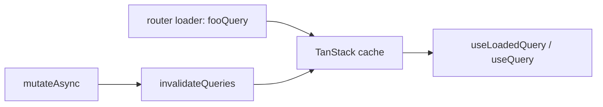

# TanStack Query

All new web-app backend requests go through TanStack Query. Imperative
`Api.foo.bar()` in loaders, generated tuple hooks (`Api.foo.useBar()`), and
`Pages.useRefresh()` are the old pattern.

When you add a feature or fix on an existing page, hook, or model module,
migrate **that surface's** queries and mutations to TanStack in the same
change. Do not leave a mixed loader (one TanStack query plus one raw `Api.*`
fetch) on the file you just edited.

For copy-paste skeletons and old→new mappings, see [reference.md](reference.md).

## When to migrate

| Situation | Do |
| --- | --- |
| New page, loader, or mutation | TanStack from the start |
| Feature or fix on an existing page/module | Migrate that surface's API calls too |
| Typeahead / search-as-you-type (`People.usePeopleSearch`, `Api.*.search` as a search fn) | Leave imperative |
| Unrelated sibling page | Do not expand the PR |
| `ProjectPage` | Only when that page is the requested work |

`ProjectPage` is the last project-page migration. A one-line copy fix there
does not require rewriting its loader.

## How it works

Generated helpers live next to each endpoint in `app/assets/js/api/index.tsx`:

| Helper | Role |
| --- | --- |
| `fooQuery(input)` | Prefetch in the router loader (`staleTime: Infinity`) |
| `fooQueryOptions(input)` | `queryKey` + `queryFn` for `useQuery` / `useLoadedQuery` |
| `fooQueryKey(input)` | Invalidate one cached input |
| `fooQueryKeyPrefix()` | Invalidate every cached input for that endpoint |
| `fooMutationOptions()` | `mutationFn` for `useMutation` |

The shared client is `app/assets/js/api/queryClient.ts`.



## Page loaders

Router loader **prefetches** and returns **inputs**, not payload:

1. Build `queryInput` (same shape the API already used).
2. `await Api.namespace.fooQuery(queryInput)` (parallelize with `Promise.all`).
3. `return { queryInput }`.
4. `useLoadedData` reads `Pages.useLoadedData()`, then
   `useLoadedQuery(Api.namespace.fooQueryOptions(queryInput))`.
5. Throw if the expected field is missing.

Use `useLoadedQuery`, not `useQuery`, when the loader prefetched. It uses
`loaderBackedQueryOptions` so the page does not refetch on mount unless the
query was invalidated.

Replace `Pages.useRefresh()` with a local `useRefresh` that
`invalidateQueries` on the page's query keys.

Canonical: [ProjectPausePage/loader.tsx](../../../app/assets/js/pages/ProjectPausePage/loader.tsx),
[ProjectDiscussionPage/loader.tsx](../../../app/assets/js/pages/ProjectDiscussionPage/loader.tsx).

Optional queries (URL may omit space/goal, or a parent fetch may fail): always
call `useLoadedQuery`, pass `enabled: input != null`, and fall back in JS.
See [reference.md](reference.md).

## Mutations

Put wrappers in `app/assets/js/models/<resource>/<resource>Lifecycle.ts` (or
`projectDiscussionLifecycle.ts` when the resource already has a sibling file).

```ts
export function useCreateProjectDiscussion() {
  const queryClient = useQueryClient();

  return useMutation({
    ...Api.projects.createDiscussionMutationOptions(),
    onSuccess: () => {
      void invalidateProjectDiscussionQueries(queryClient);
    },
  });
}
```

Pages call `mutateAsync`. Invalidate with `*QueryKeyPrefix()` so every cached
input for that endpoint refreshes. Re-export from the model's `index.tsx`.

Do not switch every remaining call site of a generated tuple hook when you add
a lifecycle wrapper. Update the surface you are on; leave others (for example
WorkMap's `Api.projects.useCreate()`) until that file is migrated.

Canonical: [projectDiscussionLifecycle.ts](../../../app/assets/js/models/projects/projectDiscussionLifecycle.ts),
[projectLifecycle.ts](../../../app/assets/js/models/projects/projectLifecycle.ts).

## Layout and non-prefetched queries

If the query is **not** prefetched in a router loader (company layout `getMe`),
wrap with `useQuery(fooQueryOptions(input))`, not `useLoadedQuery`.

Canonical: [models/people/index.tsx](../../../app/assets/js/models/people/index.tsx) `useGetMe`.

## Tests

Colocate Jest next to the lifecycle file (`fooLifecycle.test.ts`). Seed
`queryClient.setQueryData(key, {})`, run the invalidate helper, assert
`getQueryState(key)?.isInvalidated`. Cover the intended prefixes and one
unrelated key that must stay clean.

Run `make test FILE=assets/js/models/.../fooLifecycle.test.ts`.

Existing feature tests for the page are the behavior net; run the ones that
visit the migrated route.

## Do not

- Prefetch with raw `Api.foo.bar(input)` or `Projects.getProject(...)`.
- Return fetched records from the loader (`return { project }`). Return inputs.
- Use `Pages.useRefresh()` after a TanStack loader — it will not update cache.
- Introduce `PageCache.fetch` on new work.
- Extract a shared loader helper for two similar pages unless duplication is
  already painful. Include flags and parent APIs usually differ.
- Use `!` / `assertPresent` to silence missing query data. Throw or fall back.
