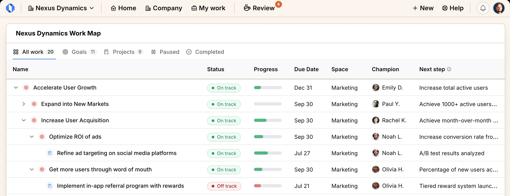

<h1 align="center">Operately</h1>

<p align="center">
  Open source company operating system
  <br />
  <a href="https://discord.gg/2ngnragJYV">Discord</a>
  ·
  <a href="https://operately.com">Website</a>
  ·
  <a href="https://github.com/operately/operately/issues">Issues</a>
</p>

<p align="center">
  <a href="https://github.com/operately/operately/blob/main/LICENSE"></a>
  <a href="https://operately.semaphoreci.com/projects/operately"></a>
  <a href="https://github.com/operately/operately/pulse"></a>
  <a href="https://discord.gg/2ngnragJYV"></a>
</p>

## About Operately



Operately helps you coordinate goals, projects, and teams without the need for a COO.

Traditional work management tools give you infinite flexibility but zero guidance on _how_ to actually run an organization. This creates chaos and drains your energy.

Operately is different. Instead of being another generic project management tool, it's an **opinionated operating system** that provides the structure and discipline your company needs to get things done as your team grows.

Unlike Notion or ClickUp that let you build anything but leave you to figure out execution, Operately comes with proven workflows built in: from goal reviews and project check-ins to accountability processes.

**Why switch?** Focus on building something people want instead of figuring out how to run your organization.

## Features

- **Goals / OKRs** - Track company-wide progress with clear targets linked directly to daily work
- **Project Management** - Keep projects on track with task boards, milestones, and consistent check-ins
- **AI Executive Coach** - Get strategic guidance and operational feedback from an AI that understands your company's goals and progress _(early beta)_
- **Team Spaces** - Give departments their own organized home for goals, projects, and documents
- **Message Boards** - Replace scattered email threads with organized discussions that build shared understanding
- **Documents & Files** - Create, store, and share content in one centralized system with proper organization
- **Team Management** - Onboard members, manage permissions, and maintain company structure
- **Execution Cadence** - Built-in check-ins and automated progress updates create a consistent rhythm that keeps teams moving forward

## Quick start

```
wget -q https://github.com/operately/operately/releases/latest/download/operately-single-host.tar.gz
tar -xf operately-single-host.tar.gz
cd operately
./install.sh
docker compose up --wait --detach
```

For more details, see [installation guide](https://operately.com/install).

## Development

- [How to contribute to Operately](CONTRIBUTING.md)
- [How to set up your development environment](docs/dev-env.md)
- [Architecture Overview](docs/architecture.md)
- [Pages, Routes and Data Loading](docs/pages-and-data-loading.md)
- [Modifying the database schema](docs/database-schema.md)
- [API](docs/api.md)

## Repo activity


