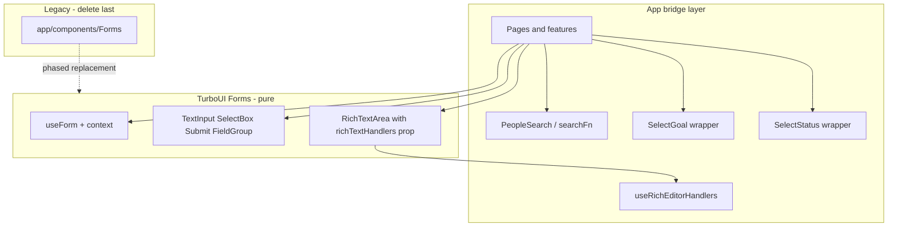

# Forms → TurboUI Migration

## Summary

Incrementally migrate `app/assets/js/components/Forms/` to `turboui/src/Forms/`. Work has already started: TurboUI Forms exists and one EE page (`SiteMessageModal`) uses it end-to-end. ~55 app/ee files still import the legacy module.

This spec defines phased steps so each PR is reviewable. TurboUI is extended first; call sites switch cohort-by-cohort; app Forms is deleted last.

Follow [`.agents/skills/components-architecture/SKILL.md`](../.agents/skills/components-architecture/SKILL.md) for TurboUI purity and the app-bridge pattern.

---

## Goals

- Pure form primitives and state management live in `turboui/src/Forms/`.
- App pages bridge backend/API concerns (e.g. `useRichEditorHandlers`, people search) via props — no `@/` imports inside TurboUI.
- Storybook documents form patterns at each phase.
- Legacy `app/assets/js/components/Forms/` is deleted when grep shows zero imports.

---

## Current State

### Already in TurboUI (`turboui/src/Forms/`)

| Piece | Notes |
| ----- | ----- |
| `useForm`, `Form`, `context` | Nested field paths via `path.ts` |
| `TextInput`, `SelectBox`, `Submit`, `FieldGroup`, `InputField` | `FieldGroup`: vertical, horizontal, grid |
| `Input`, `Label`, `ErrorMessage` | Primitives (Phase 1) |
| `PasswordInput`, `NumberInput`, `CheckboxInput`, `RadioButtons`, `TitleInput` | Field components (Phase 1) |
| `RichTextArea` | Pure: accepts `richTextHandlers` prop |
| `validation.ts` | `validatePresence`, `validateRichContentPresence`, `validateTextLength`, `validateIsNumber`, `useValidation` |
| Tests | `index.test.tsx` |
| Storybook | `Inputs.stories.tsx`, `FieldGroup.stories.tsx` (Phase 1) |

Exported as `import { Forms } from "turboui"`.

### Reference implementation

`app/ee/assets/js/pages/SaasAdminSiteMessagesPage/SiteMessageModal.tsx` — canonical pattern:

```tsx
import { Forms } from "turboui";

const richTextHandlers = useRichEditorHandlers();
const form = Forms.useForm({ fields: { ... }, submit: async () => { ... } });

<Forms.Form form={form}>
  <Forms.TextInput field="title" label="Title" required />
  <Forms.RichTextArea field="description" richTextHandlers={richTextHandlers} />
  <Forms.Submit />
</Forms.Form>
```

### Still in app only (`app/assets/js/components/Forms/`)

**Core gaps vs TurboUI:**

- [x] `useForm`: `trigger` / `setTrigger`, `addErrors` / `removeErrors`, `onError` (AxiosError)
- [x] `FieldGroup`: `horizontal` and `grid` layouts
- [x] `Submit`: `layout`, `submitOnEnter`, `buttonSize`, `testId`, `containerClassName`
- [ ] `SubmitButton`: multi-action submit (check-in forms)
- [x] Validations: `textLength`, `isNumber`
- [x] Inputs: `PasswordInput`, `NumberInput`, `CheckboxInput`, `RadioButtons`, `TitleInput`
- [x] Feedback: `FormError`
- [x] Feedback: `ErrorMessage`
- [x] Primitives: `Elements/Input`, `Elements/Label` (GoalTargetsV2)

**App-coupled fields (bridge, not pure TurboUI):**

| Component | Coupling |
| --------- | -------- |
| `SelectPerson` | `@/models/people`, `@/components/PeopleSearch` — accepts `searchFn` |
| `SelectGoal` | `@/models/goals`, `@/features/goals/GoalTree/GoalSelectorDropdown` |
| `SelectStatus` | `@/components/status`, `@/models/people` |
| App `RichTextArea` | `mentionSearchScope` + internal `useRichEditorHandlers` |

**Scale:** ~55 app/ee files import `@/components/Forms`. Migration is import-style change (`import Forms from "@/components/Forms"` → `import { Forms } from "turboui"`) plus API adjustments per cohort.

---

## Implementation Status

**Phases 0 and 1 are complete.** Phases 2–8 are not yet implemented. Each remaining phase should land as one or more focused PRs following the checklists below.

| Phase | Status |
| ----- | ------ |
| 0 — API Parity Foundation | [x] Complete |
| 1 — Input Primitives and FieldGroup Layouts | [x] Complete |
| 2 — Auth and Account Forms | [x] Complete |
| 3 — Standard CRUD Forms | [ ] In progress (3a + 3b done) |
| 4 — RichTextArea Cohort | [ ] In progress |
| 5 — Multi-Action Submit and Check-Ins | [ ] Not started |
| 6 — Domain Selector Bridges | [ ] Not started |
| 7 — GoalTargetsV2 and Stragglers | [ ] Not started |
| 8 — Delete Legacy App Forms | [ ] Not started |



---

## Migration Principles

1. **One cohort per PR** — migrate a logical group of call sites, not the whole tree.
2. **TurboUI first, then switch imports** — extend TurboUI before moving call sites.
3. **App-coupled fields stay in app** as thin wrappers using TurboUI `InputField`. No `@/` imports in TurboUI.
4. **RichTextArea:** TurboUI accepts `richTextHandlers`; app pages call `useRichEditorHandlers()` and pass the result.
5. **No big-bang** — legacy app Forms stays until Phase 8.
6. **Storybook is part of done** for each phase.
7. **Verify:** `make turboui.build && make turboui.test` and `make test.tsc.lint` after each phase.

---

## Phase 0 — API Parity Foundation

**Phase complete:** [x]

**Goal:** Extend TurboUI `useForm` and shared primitives so simple migrations do not regress.

### TurboUI work

- [x] `useForm`: `addErrors`, `removeErrors`, `trigger`, `setTrigger`, optional `onError`
- [x] Validations: `validateTextLength`, `validateIsNumber` *(landed in Phase 1)*
- [x] `TextInput`: `hidden`, `minLength`, `maxLength`, `onEnter`, `okSign`
- [x] `Submit`: `layout`, `submitOnEnter`, `buttonSize`, `testId`, `containerClassName`
- [x] `FormError` presentational component
- [x] `ErrorMessage` presentational component *(landed in Phase 1)*

### Storybook

- [x] `Forms.stories.tsx`: basic form, validation errors, cancel flow, nested paths

### Acceptance

- [x] SiteMessageModal still works
- [x] No app call-site changes
- [x] `make turboui.build && make turboui.test`
- [x] `make test.tsc.lint`

---

## Phase 1 — Input Primitives and FieldGroup Layouts

**Phase complete:** [x]

**Goal:** Port reusable building blocks.

### TurboUI work

- [x] `Input.tsx`, `Label.tsx` (from `Elements/`)
- [x] `ErrorMessage.tsx`
- [x] `FieldGroup` horizontal + grid layouts (`Context`, `Vertical`, `Horizontal`, `Grid`)
- [x] `PasswordInput`, `NumberInput`, `CheckboxInput`, `RadioButtons`, `TitleInput`
- [x] `validateTextLength`, `validateIsNumber` in `validation.ts`
- [x] Tests in `index.test.tsx`

### Storybook

- [x] `Inputs.stories.tsx`
- [x] `FieldGroup.stories.tsx`

### Acceptance

- [x] Exported from `turboui/src/Forms/index.tsx`
- [x] Stories render in Storybook
- [x] No app call-site changes
- [x] `make turboui.build && make turboui.test`
- [x] `make test.tsc.lint`

---

## Phase 2 — Auth and Account Forms

**Phase complete:** [x]

**Goal:** First call-site cohort (~8 pages).

### Migrate (~8 files)

- [x] `app/assets/js/pages/LoginPage/index.tsx`
- [x] `app/assets/js/pages/ForgotPasswordPage/index.tsx`
- [x] `app/assets/js/pages/ResetPasswordPage/index.tsx`
- [x] `app/assets/js/pages/AccountChangePasswordPage/index.tsx`
- [x] `app/assets/js/pages/CompanyRenamePage/index.tsx`
- [x] `app/assets/js/pages/AccountAppearancePage/index.tsx`
- [x] `app/assets/js/pages/NewCompanyPage/index.tsx`
- [x] `app/assets/js/pages/JoinPage/index.tsx` (text/password fields only)

### Pattern

```tsx
import { Forms } from "turboui";
```

### Storybook

- [ ] `Composed.stories.tsx`: AuthForm, RenameCompanyForm

### Acceptance

- [x] `rg '@/components/Forms'` empty for Phase 2 files
- [x] `make test.tsc.lint`

---

## Phase 3 — Standard CRUD Forms

**Phase complete:** [ ]

**Goal:** Text + select + submit, no RichTextArea or domain selectors (~15 files).

### Migrate (~15 files)

**Phase 3b (access selectors + access-level pages):** [x] `Forms.AccessSelectors` in TurboUI, `SpaceAddPage`, `SpaceEditGeneralAccessPage`, `ProjectEditAccessLevelsPage`, `GoalEditAccessLevelsPage`. TurboUI now exports `useFormContext`. `features/projects/AccessSelectors` stays on legacy Forms until `ProjectAddPage` migrates in Phase 6. Remaining Phase 3 files blocked on SelectPerson/SelectGoal (Phase 6) or RichTextArea (Phase 4).

- [x] `app/assets/js/pages/SpaceAddPage/index.tsx`
- [ ] `app/assets/js/pages/SpaceAddMembersPage/index.tsx`
- [x] `app/assets/js/pages/SpaceEditPage/index.tsx`
- [x] `app/assets/js/pages/SpaceEditGeneralAccessPage/index.tsx`
- [ ] `app/assets/js/pages/ProjectAddPage/page.tsx`
- [x] `app/assets/js/pages/ProjectEditAccessLevelsPage/index.tsx`
- [ ] `app/assets/js/pages/GoalAccessAddPage/index.tsx`
- [x] `app/assets/js/pages/GoalEditAccessLevelsPage/index.tsx`
- [x] `app/assets/js/pages/ProjectResumePage/Form.tsx` *(Phase 4)*
- [ ] `app/assets/js/pages/ProjectContributorsAddPage/*`
- [ ] `app/assets/js/pages/ProjectContributorsEditPage/ChangeChampion.tsx`
- [ ] `app/assets/js/pages/ProjectContributorsEditPage/ChangeReviewer.tsx`
- [ ] `app/assets/js/pages/CompanyAdminTrustedEmailDomainsPage/page.tsx`
- [x] `app/ee/assets/js/pages/SaasAdminBillingCatalogPage/PlanDefinitionModal.tsx`
- [x] `app/ee/assets/js/pages/SaasAdminBillingCatalogPage/ProductModal.tsx`
- [x] `app/ee/assets/js/pages/SaasAdminEmailSettingsPage/TestEmailModal.tsx`
- [x] `app/ee/assets/js/pages/SaasAdminCompanyPage/EnableFeatureModal.tsx`

### Storybook

- [ ] AccessLevelForm, AddSpaceForm, BillingCatalogForm

### Acceptance

- [ ] Phase 3 cohort grep clean
- [ ] `make test.tsc.lint`

---

## Phase 4 — RichTextArea Cohort

**Phase complete:** [ ]

**Goal:** All rich text on TurboUI; delete app `RichTextArea.tsx`.

### TurboUI work

- [x] `readonly` mode + styling props on TurboUI `RichTextArea`
- [x] Call sites: `richTextHandlers={useRichEditorHandlers({ scope })}`

### Migrate (~12 files)

- [ ] `app/assets/js/pages/ResourceHubNewDocumentPage/form.tsx`
- [ ] `app/assets/js/pages/ResourceHubEditDocumentPage/form.tsx`
- [ ] `app/assets/js/pages/ResourceHubEditFilePage/form.tsx`
- [x] `app/assets/js/pages/ResourceHubEditLinkPage/form.tsx`
- [x] `app/assets/js/pages/ResourceHubNewLinkPage/form.tsx`
- [ ] `app/assets/js/features/DiscussionForm/Form.tsx`
- [ ] `app/assets/js/pages/ProjectDiscussionNewPage/index.tsx`
- [ ] `app/assets/js/pages/ProjectDiscussionEditPage/index.tsx`
- [ ] `app/assets/js/pages/GoalDiscussionNewPage/Form.tsx`
- [ ] `app/assets/js/pages/GoalDiscussionEditPage/index.tsx`
- [x] `app/assets/js/features/ProjectRetrospective/Form.tsx`
- [x] `app/assets/js/pages/GoalClosingPage/Form.tsx`
- [x] `app/assets/js/pages/ProjectResumePage/Form.tsx`
- [ ] Grep `Forms.RichTextArea` for any remaining call sites

### Storybook

- [ ] `RichTextArea.stories.tsx` with `createMockRichEditorHandlers()`

### Acceptance

- [ ] App `RichTextArea.tsx` deleted
- [ ] `make test.tsc.lint`

---

## Phase 5 — Multi-Action Submit and Check-Ins

**Phase complete:** [ ]

**Goal:** `SubmitButton`, `setTrigger`, `SelectStatus` bridge.

### TurboUI work

- [ ] Port `SubmitButton`

### App bridge

- [ ] `app/assets/js/features/forms/SelectStatus.tsx`

### Migrate (~6 files)

- [ ] `app/assets/js/pages/ProjectCheckInNewPage/Form.tsx`
- [ ] `app/assets/js/pages/ProjectCheckInEditPage/Form.tsx`
- [ ] `app/assets/js/pages/ProjectCheckInPage/page.tsx`
- [ ] `app/assets/js/features/goals/GoalCheckIn/Form.tsx`
- [ ] `app/assets/js/pages/GoalCheckInPage/Options.tsx`
- [ ] `app/assets/js/pages/ResourceHubNewDocumentPage/form.tsx` (SubmitButton draft/publish)

### Storybook

- [ ] MultiSubmitForm, CheckInForm composition

### Acceptance

- [ ] Check-in flows work; `SubmitButton` only in TurboUI
- [ ] `make test.tsc.lint`

---

## Phase 6 — Domain Selector Bridges

**Phase complete:** [ ]

**Goal:** Pure `SelectPerson` in TurboUI; goal/status bridges in app.

### TurboUI work

- [ ] `SelectPerson` with `searchFn` prop (no PeopleSearch import)

### App bridge

- [ ] `app/assets/js/features/forms/SelectGoal.tsx`
- [ ] `app/assets/js/features/forms/SelectStatus.tsx`

### Migrate (~10 files)

- [ ] `app/assets/js/pages/ProjectContributorsAddPage/*`
- [ ] `app/assets/js/pages/ProjectContributorsEditPage/*`
- [ ] `app/assets/js/pages/ProjectAddPage/page.tsx`
- [ ] `app/assets/js/pages/SignUpWithEmailPage/index.tsx`
- [ ] Grep `Forms.SelectPerson` and `Forms.SelectGoal` for remaining call sites

### Acceptance

- [ ] No SelectPerson/SelectGoal/SelectStatus under `app/components/Forms/`
- [ ] `make test.tsc.lint`

---

## Phase 7 — GoalTargetsV2 and Stragglers

**Phase complete:** [ ]

**Goal:** Zero `@/components/Forms` imports repo-wide.

### Work

- [ ] `app/assets/js/features/goals/GoalTargetsV2/components/TargetTextField.tsx` — import `Input`, `Label` from turboui Forms
- [ ] `app/assets/js/features/goals/GoalTargetsV2/components/TargetNumericField.tsx`
- [ ] `app/assets/js/features/goals/GoalTargetsV2/targetErrors.tsx` — TurboUI form context types
- [ ] Remaining pages: `SetupPage`, `SignUpWithEmailPage` (if not done in Phase 2/6), `AccessSelectors`, resource hub page-level forms, EE stragglers
- [ ] `app/ee/assets/js/pages/SaasAdminEmailSettingsPage/EmailSettingsSection.tsx` (FieldGroup grid — requires Phase 1)

### Acceptance

- [ ] `rg '@/components/Forms'` returns no matches in app/ee
- [ ] `make test.tsc.lint`

---

## Phase 8 — Delete Legacy App Forms

**Phase complete:** [ ]

**Goal:** Remove deprecated module.

### Work

- [ ] Delete `app/assets/js/components/Forms/`
- [ ] Update EE jest mocks to mock `turboui` Forms
- [ ] Update `.agents/skills/components-architecture/reference.md`

### Acceptance

- [ ] Folder gone; CI green
- [ ] `make test.tsc.lint`

---

## Storybook Structure

| File | Contents | Status |
| ---- | -------- | ------ |
| `Forms.stories.tsx` | Basic form, validation, cancel, nested paths | [x] |
| `Inputs.stories.tsx` | TextInput, Password, Number, Checkbox, Radio, Title | [x] |
| `FieldGroup.stories.tsx` | vertical / horizontal / grid | [x] |
| `RichTextArea.stories.tsx` | editable + readonly | [ ] |
| `Composed.stories.tsx` | AuthForm, AccessForm, MultiSubmitForm, SelectPersonForm | [ ] |

Stories use `Forms.useForm` and mock handlers from `turboui/src/utils/storybook/richEditor`.

---

## API Appendix

| App API | TurboUI equivalent |
| ------- | ------------------ |
| `import Forms from "@/components/Forms"` | `import { Forms } from "turboui"` |
| `mentionSearchScope` on RichTextArea | `richTextHandlers={useRichEditorHandlers({ scope })}` |
| `form.actions.setTrigger(name)` | TurboUI `form.actions.setTrigger(name)` (Phase 0) |
| `form.actions.addErrors({ _submit: msg })` | TurboUI `form.actions.addErrors(...)` (Phase 0) |
| `Forms.FieldGroup layout="grid"` | TurboUI FieldGroup (Phase 1) |
| `SelectGoal` / `SelectStatus` | App bridge in `features/forms/` |

---

## Risks

- **useForm API drift** — Phase 0 before check-in cohorts (Phase 5).
- **FieldGroup grid** — required for EE email/billing; Phase 1 before Phase 3 EE files.
- **Modal autoFocus** — preserve `data-autofocus` on Input primitive.
- **Parallel work** — Phases 2–7 can split by file list; Phase 0→1 sequential.

---

## Phase Checklist Template

Each implementation PR should verify:

- [ ] TurboUI changes merged and exported
- [ ] Call sites updated (if applicable)
- [ ] Storybook stories added/updated
- [ ] `make turboui.build && make turboui.test`
- [ ] `make test.tsc.lint`
- [ ] `rg '@/components/Forms' <cohort-paths>` clean (when migrating call sites)
